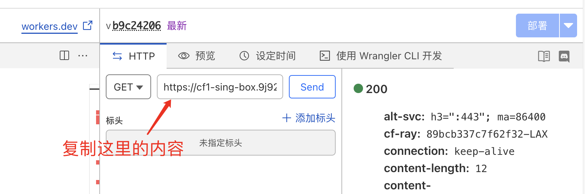
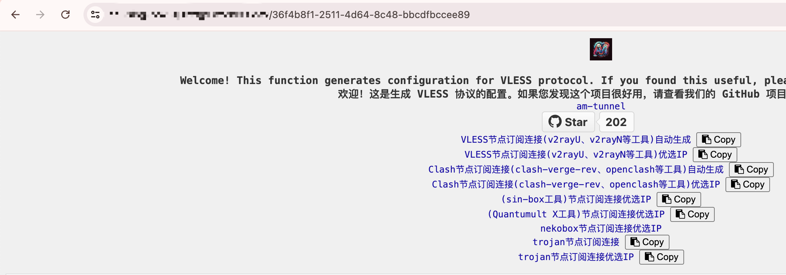

# 使用 Cloudflare Workers 部署 Sing-box 节点

## 1.使用 Cloudflare Workers 部署 _worker.js 生成节点订阅信息

需要登录 Cloudflare 账号【这里没有 Cloudflare 账号可以先去注册，注册 Cloudflare 账号需要邮箱，这里可以使用临时生成的邮箱：[这是临时邮箱的可用网站，需要魔法](https://www.linshiyouxiang.net/)，也可以使用自己的邮箱】，选择 开始使用 Workers 和 Pages，创建 Worker 【这里的Worker项目名称自定义】，然后编辑 Worker 的代码，将 _worker.js 代码复制进去，将 _worker.js 代码中的userID的内容修改一下【这里修改的内容是uuid，可以使用uuid生成器来生成】，然后点击部署，即可使用。

生成uuid的工具网站：[https://1024tools.com/uuid](https://1024tools.com/uuid)

## 2.配置 Sing-box 节点

部署好 _worker.js 后，就可以使用节点订阅了，配置节点订阅地址为：https://你的域名/你的uuid，即可使用。

上图的就是 worker 部署后 Cloudflare 给分配的域名，然后订阅地址就是这里内容/uuid，这里的uuid就是部署 _worker.js 时修改的 uuid。

访问生成的节点订阅链接如以下图片所示：

然后打开Clash节点订阅链接，将uuid和Host复制出来。

配置 sing-box 的配置文件文件，根据当前项目的 singbox-1.8.4-vless&vmess.json 文件修改就行了。

优选ip可以使用这个[网站来测试延迟](https://ping.chinaz.com/)。